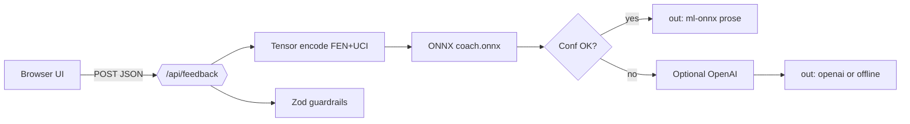

# ChessSense AI — Applied AI System

**Applied AI coursework / portfolio artifact:** an end-to-end style-based chess training app where learners play moves from curated puzzles, receive **deterministic heuristic grading**, and get **coach-style prose** routed through either a **small specialized neural model** (ONNX), **OpenAI**, or a **deterministic fallback**—with **confidence gating**, **validation**, **structured logs**, and a **repeatable evaluation script**.

---

## Origin project (Modules 1–3 baseline)

This work extends **[ChessSense AI](PROJECT_PLAN.md)** (concept / MVP sketch): a puzzle-driven “guess-the-best-move” trainer with modes (tactical through engine-style prompts), SAN/UCI grounding, JSON puzzle bank, session summary, and (optionally) generative explanations.  

**What changed here:** Heuristic grading stayed on-device; coaching text is now mediated by trained **five-class ONNX head** embeddings + threshold, fallback LLM prose, offline copy, observable **evaluation** vs labels, server **logging**, and **guardrails**.

---

## What this build demonstrates (requirements mapping)

| Course expectation | Implemented here |
|--------------------|-------------------|
| **Purposeful AI** | Coach narration after each attempt; grade class + prose. |
| **≥1 AI feature:** *specialized/fine-tuned model* | **`GradeHead` MLP** trained in Python on heuristic-aligned labels (`ml/src/train.py`), exported ONNX (`coach.onnx`), loaded in Next `/api/feedback`; **confidence threshold** rejects low-softmax guesses → safe fallback chain. |
| **Integrated behaviour** | Web encodes tensors (`web/lib/ml/encode.ts`), server runs ONNX + routing—**not** a standalone demo script alone. |
| **Retrieval/agent** *(optional variants)* | **Not implemented** as retrieval over documents; rationale in [Design decisions](#design-decisions). |
| **Reliability / testing** | Zod body validation; evaluation harness `ml/src/evaluate.py`; puzzle JSON validator `npm run validate-puzzles`; structured server logs in `app/api/feedback/route.ts`. |
| **Logging / guardrails** | JSON line logs (no FEN in logs); OpenAI errors truncated; invalid JSON / schema logged. |
| **Reproducible setup** | Env vars + train/export steps below. |

---

## Architecture overview

**Layers:** Browser (Next.js) → `POST /api/feedback` → encode FEN/UCI tensor → ONNX **coach** softmax → optional accept if confidence ≥ **`ML_COACH_MIN_CONF`**; else prompt OpenAI → if missing key / error → deterministic offline baseline.

**Humans:** Learners inspect board + grade; graders/tas can rerun `evaluate.py`, read logs from server output, sanity-check outputs in README samples.

Embedded diagram (GitHub renders Mermaid):



**Optional raster copy:** Paste the source in [`assets/architecture.mmd`](assets/architecture.mmd) into [Mermaid Live Editor](https://mermaid.live/), export PNG into `assets/` for slides or LMS uploads.

---

## Setup (development)

### 1) Web UI

```bash
cd web
npm install
npm run validate-puzzles
npm run dev
```

Open `http://localhost:3000` — navigate **Train** → solve moves → inspect coach card.

Prod build:

```bash
npm run build && npm run start
```

### 2) Train / evaluate small coach (Python)

See [`ml/README.md`](ml/README.md). Short path:

```bash
cd ml
python -m venv .venv
# Linux/macOS: source .venv/bin/activate | Windows: .venv\Scripts\activate
pip install -r requirements.txt
cd src
python train.py
python export_onnx.py
python evaluate.py   # aggregate agreement vs heuristic labels
```

Artifacts (gitignored by default):

| Path | Role |
|------|------|
| `web/artifacts/coach.pt` | PyTorch checkpoint |
| `web/artifacts/coach.onnx` | Runtime ONNX (run API from repo root **or** `web/` paths resolve) |

### Environment variables

| Variable | Where | Purpose |
|----------|--------|---------|
| `OPENAI_API_KEY` | Next server | Enable OpenAI-backed coach prose when ONNX rejects or misses. |
| `OPENAI_MODEL` or `OPEN_AI_MODEL` | Next server | Model id (defaults to `gpt-4o-mini` in API route). |
| `ML_COACH_MODEL_PATH` | Next server | Optional explicit path to `coach.onnx`. |
| `ML_COACH_MIN_CONF` | Next server | Softmax peak floor **0.05–1** (default **0.38**). |

---

## Sample interactions (qualitative)

**1) UX path (no API key):** Start session → play a move → submit → grade + **offline** coach copy (source `offline` in JSON if you inspect network).  

**2) ML path:** With `coach.onnx` deployed and confidently predicted class → JSON contains `"source":"ml-onnx"` and `mlConfidence`/`mlGrade`. Coach paragraph references grade + style briefly.  

**3) Evaluation script (automated numeric):**

```text
Agreement with heuristic: 230/233 (98.7%)   # illustrative; rerun evaluate.py locally
Mean softmax confidence:  0.9821            # illustrative
```

_quote your own laptop’s `evaluate.py` output in coursework — numbers vary slightly with RNG / PyTorch._

---

## Design decisions / trade-offs

- **Small specialized head vs RAG:** Puzzles are structured (FEN/SAN)—the course “retrieval” would be querying a corpus; here priorities were **tabular encoding + ONNX latency** instead of unstructured document lookup. Retrieval could augment later (**e.g.** lichess-theory excerpts per opening tag).
- **Heuristic oracle labels:** Training targets mirror `grade.ts`; the model inherits **limitations of heuristics**, not oracle engine truth—a documented bias.
- **Confidence gate:** Raises precision of displayed grade class at expense of heavier OpenAI/offline reliance when uncertain—intentionally conservative for classroom demos.
- **Privacy / logs:** Structured logs omit FEN/full prompts to reduce accidental position leakage.

---

## Testing summary (template sentence for reports)

Adapt with your **`evaluate.py`** + manual session runs:

> **Automated:** `python ml/src/evaluate.py` — X/Y agreement with heuristic labels; mean softmax ≈ **Z**. **Manual:** Navigate Train → Session → Submit 3 puzzles; ONNX path when ONNX present else offline banner. **`npm run validate-puzzles`** — puzzles JSON sane. **`npm run build`** passes.

---

## Demonstration media (submission checklist)

Replace placeholder with your own recording URL:

**Loom / video walk-through (required):** `[ADD YOUR VIDEO URL HERE]`  

Show: (a) Train → puzzle → submit, (b) network response illustrating **specialized ONNX path** (`ml-onnx`) vs fallback **OpenAI**/offline **once**, (c) `evaluate.py` terminal summary snippet.

---

## Repository layout

- `web/` — Next.js App Router, UI, API route, ONNX loading.
- `ml/src/` — Encode parity, dataset, train, ONNX export **`evaluate.py`**.
- `assets/` — Diagram source + raster exports for slides/portfolio.

---

## License

MIT — see [`LICENSE`](LICENSE).
